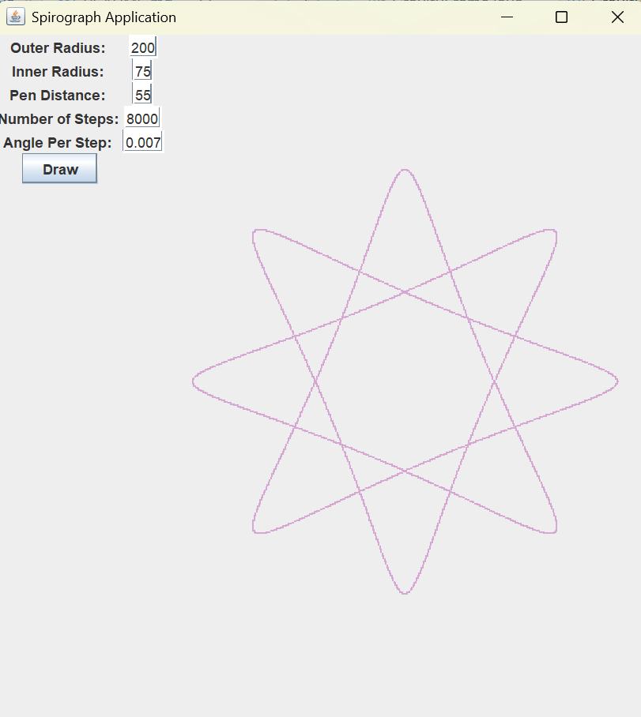

### Spirograph Animation

A GUI that animates the drawing of a spirograph depending on the user-provided size.

### Screenshots

#### Links
- [Mockito for testing](https://site.mockito.org/)
- [Junit for testing](https://docs.junit.org/5.10.1/api/org.junit.jupiter.api/org/junit/jupiter/api/Assertions.html)
- [GridBagLayout for GUI Layout](https://docs.oracle.com/javase/tutorial/uiswing/layout/gridbag.html)